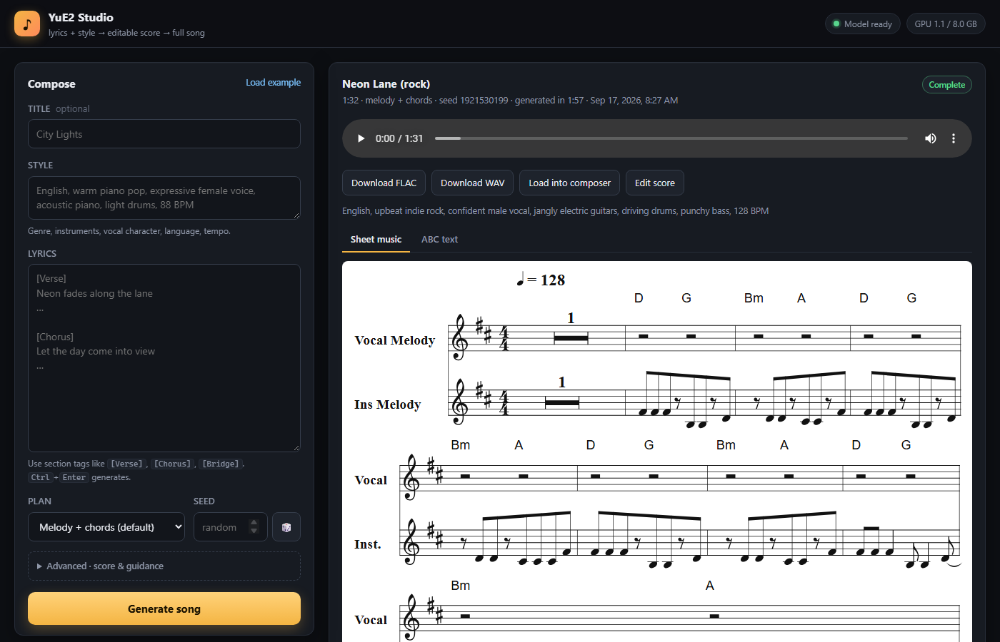

# YuE2 Studio — YuE2 song generation on an 8 GB GPU, with a web UI

[YuE2](https://github.com/multimodal-art-projection/YuE) turns lyrics and a style prompt into an editable melody-and-chord score and then a full 48 kHz stereo song with vocals. Upstream targets **Linux, Python 3.12 and a 24 GB GPU**. This repo runs it on **Windows with an RTX 4060 (8 GB)**, unquantized, at roughly one minute of compute per minute of audio, and wraps it in a local web app.



| File | What |
|---|---|
| `webui.py` + `webui/` | Local web app: compose, live stage progress, cancel/queue, in-page playback, score rendered as sheet music, edit-and-re-render, library of past songs |
| `run_lowvram.py` | The 8 GB runner (also a CLI). Monkey-patches the upstream package at import time; the `YuE/` submodule is never modified |
| `download_models.py` | Fetches the ~7.3 GB of weights into `models/` as plain files |
| `Start YuE2 Studio.cmd` | Double-click launcher for the web app |
| `YuE/` | Upstream repository, pinned as a git submodule |

## Setup (Windows)

Requirements: an NVIDIA GPU with BF16 support and at least 8 GB VRAM (compute capability ≥ 8.0; FP8 mode needs ≥ 8.9), a recent driver, Python 3.10+ (`py -3.11` below), git, ~15 GB of disk, and enough RAM to hold the model between songs (16 GB works, 32 GB+ is comfortable).

```powershell
git clone --recurse-submodules https://github.com/jrlabanza/yue2-studio.git
cd yue2-studio
py -3.11 -m venv YuE\.venv
YuE\.venv\Scripts\python.exe -m pip install --upgrade pip
YuE\.venv\Scripts\python.exe -m pip install torch==2.10.0 --index-url https://download.pytorch.org/whl/cu128
YuE\.venv\Scripts\python.exe -m pip install -e YuE
YuE\.venv\Scripts\python.exe -m pip install -r requirements.txt
YuE\.venv\Scripts\python.exe download_models.py
```

The venv lives inside `YuE\` because that is where the launcher and scripts look for it. Install PyTorch from the CUDA index *before* `pip install -e YuE` so the pinned `torch==2.10.0` resolves to the CUDA build.

## Use the web app

Double-click **`Start YuE2 Studio.cmd`**, or:

```powershell
YuE\.venv\Scripts\python.exe webui.py --open
```

The page opens at http://127.0.0.1:7860 once the server is up (~10 s; the model is loaded into RAM once and kept there).

- **Compose** — style prompt (genre, instruments, vocal, language, tempo), lyrics with `[Verse]`/`[Chorus]` tags, plan mode, seed. *Load example* fills in the upstream song. `Ctrl+Enter` generates.
- **Progress** — each stage live (plan score → semantic tokens → synthesize → decode) with tokens/s and an audio-length estimate, a *Cancel* button, and a queue for further requests.
- **Result** — plays in the page; FLAC/WAV downloads; the generated score as sheet music (abcjs, bundled) or ABC text; *Load into composer* to remix; *Edit score* to change harmony or melody and re-render — the white-box editing flow from the upstream docs.
- **Library** — every song in `outputs/`, newest first. Each folder keeps `audio.flac`, `score.abc`, `plan.json`, `semantic.npy`, `latent.npy`, `request.json`, `result.json`.

Flags: `--host 0.0.0.0` to use it from a phone on the same network, `--quantization fp8` for an even smaller GPU footprint (slower: eager decoding), `--gpu-reserve-gib 1.5` if you close other GPU apps. The GPU is only used while a song is generating.

## Command line

```powershell
YuE\.venv\Scripts\python.exe run_lowvram.py --output outputs\first-song
YuE\.venv\Scripts\python.exe run_lowvram.py --style "English, indie rock, male vocal, 120 BPM" --lyrics-file lyrics.txt --output outputs\rock
YuE\.venv\Scripts\python.exe run_lowvram.py --request my-song.json --cot melody --abc-file YuE\examples\melody.abc --output outputs\melody
```

`--cot full|melody|off`, `--abc-file` (needs `full` or `melody`), `--seed`, `--cfg-scale`, `--quantization fp8`. Output directories must be fresh. See `YuE/docs/` for the upstream generation, editing and cover guides.

## How the 8 GB fit works

The 3B model is 6.8 GB in BF16 and the upstream pipeline caps itself at total VRAM minus 2 GB, so on an 8 GB card the stock scripts cannot even load it. `run_lowvram.py` subclasses the pipeline and keeps only the half of the AR–NAR Mixture-of-Transformers model that is in use on the GPU, parking the rest in system RAM:

| Phase | On the GPU | In RAM |
|---|---|---|
| Plan score / semantic tokens | AR layers, embeddings, lm_head | NAR layers |
| NAR prefill | AR layers, embeddings | NAR layers, lm_head |
| NAR flow matching | NAR layers | AR layers, embeddings |
| VAE decode | VAE | transformer |

Measured peak: **5.2 GiB** for a 90-second song, with CUDA-graph decoding at ~44 tokens/s on an RTX 4060.

It also works around two gaps in the Windows PyTorch wheel: FlashAttention is not compiled in, so grouped-query SDPA silently falls back to the O(n²) math kernel (about 24 GB at song length) — K/V heads are expanded instead, which selects the fused memory-efficient kernel; and the CUDA-graph decoder is pointed at cuDNN attention rather than the missing flash entrypoint. Everything else (BF16 weights, sampling, the exact NAR prefill) is upstream behaviour.

## Licenses

`YuE/` is the upstream code under Apache-2.0 (see `YuE/LICENSE`). The model weights downloaded by `download_models.py` are under **CC BY-NC 4.0 with an additional creator permission** (see `YuE/MODEL_LICENSE`): free for personal use and content creators, non-commercial for research, and companies need a commercial license from the YuE2 authors. `webui/vendor/abcjs-basic-min.js` is [abcjs](https://abcjs.net) (MIT).
